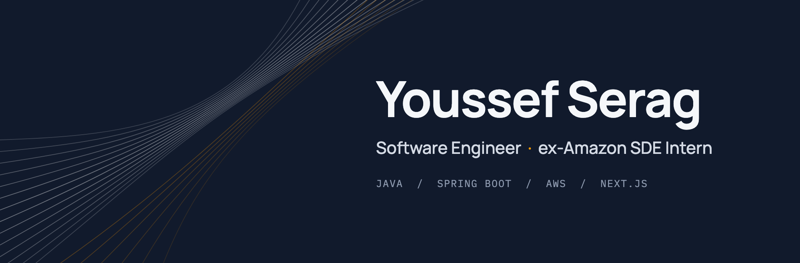
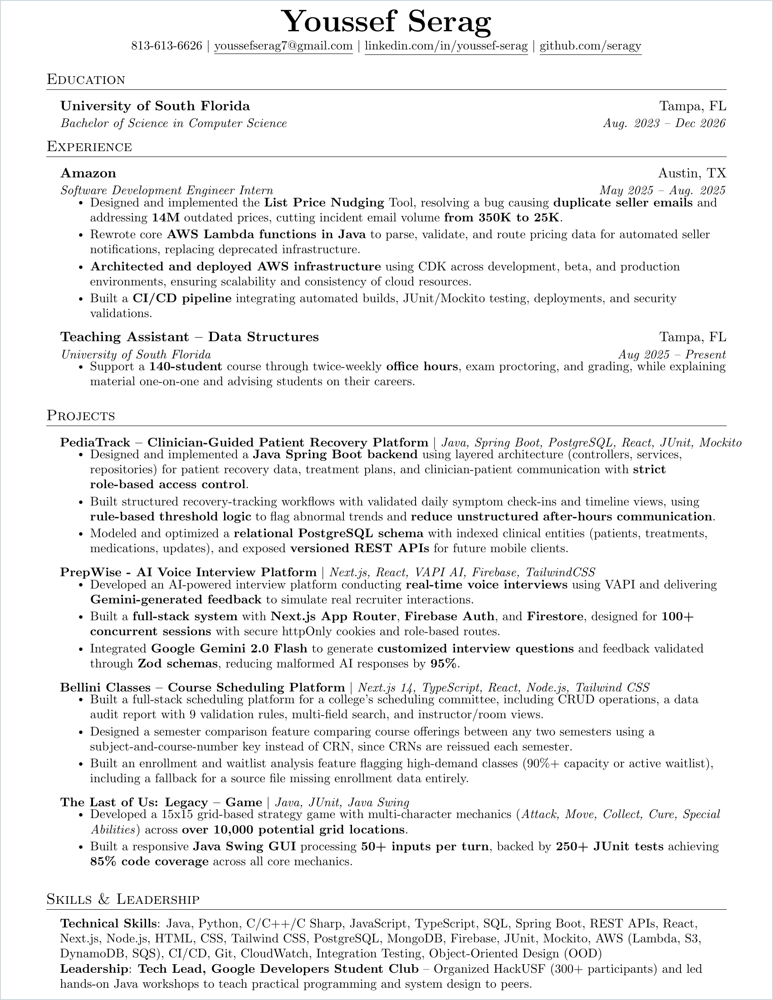

  

  
  
  

  

## Hey, I'm Youssef

I'm a Computer Science student at the **University of South Florida** (graduating December 2026), a former **Software Development Engineer Intern at Amazon**, and a **Teaching Assistant for Data Structures**. I like backend and cloud work most: services that handle real traffic, infrastructure defined as code, and tests that catch problems before users do.

Right now I'm especially interested in:

- backend services in Java and Spring Boot with clean, layered architecture
- serverless and event-driven systems on AWS (Lambda, SQS, DynamoDB), deployed with CDK
- full-stack products that use LLMs reliably, with validated, structured output
- teaching data structures and helping other students get into software engineering

## Highlights

- 📦 **Amazon, SDE Intern**: built the List Price Nudging Tool, fixing duplicate seller emails across **14M** outdated prices and cutting incident email volume from **350K to 25K**
- ☁️ **AWS in production**: rewrote core **Lambda** functions in Java, deployed infrastructure with **CDK** across dev, beta, and prod, and built a CI/CD pipeline with JUnit/Mockito and security checks
- 🧑‍🏫 **Teaching Assistant**: supporting a **140-student** Data Structures course at USF
- 🚀 **Tech Lead, Google Developer Student Club**: helped organize **HackUSF** (300+ participants) and led Java workshops

## Featured Projects

| Project | What it is |
| --- | --- |
| [**PediaTrack**](https://github.com/seragy/pediatrack) | Clinician-guided patient recovery platform. Spring Boot backend with role-based access, rule-based symptom trend flags, and versioned REST APIs over PostgreSQL. |
| [**PrepWise**](https://github.com/seragy/ai_mock_interviews) | AI voice interview platform with real-time interviews via VAPI and Gemini feedback. Zod validation cut malformed AI responses by **95%**. |
| [**Bellini Classes**](https://github.com/seragy/bellini-classes) | Course scheduling platform for USF's scheduling committee, with a 9-rule data audit, semester comparison, and waitlist analysis. |
| **The Last of Us: Legacy** | Turn-based zombie survival strategy game in Java Swing, backed by **250+ JUnit tests** at 85% coverage. |

## Tech Stack

  

**Cloud:** AWS Lambda · S3 · DynamoDB · SQS · CDK · CloudWatch · CI/CD

**Testing:** JUnit · Mockito · Integration Testing

**Design:** REST APIs · Object-Oriented Design · Role-Based Access Control

## Resume

<b>View my full resume</b>

 

